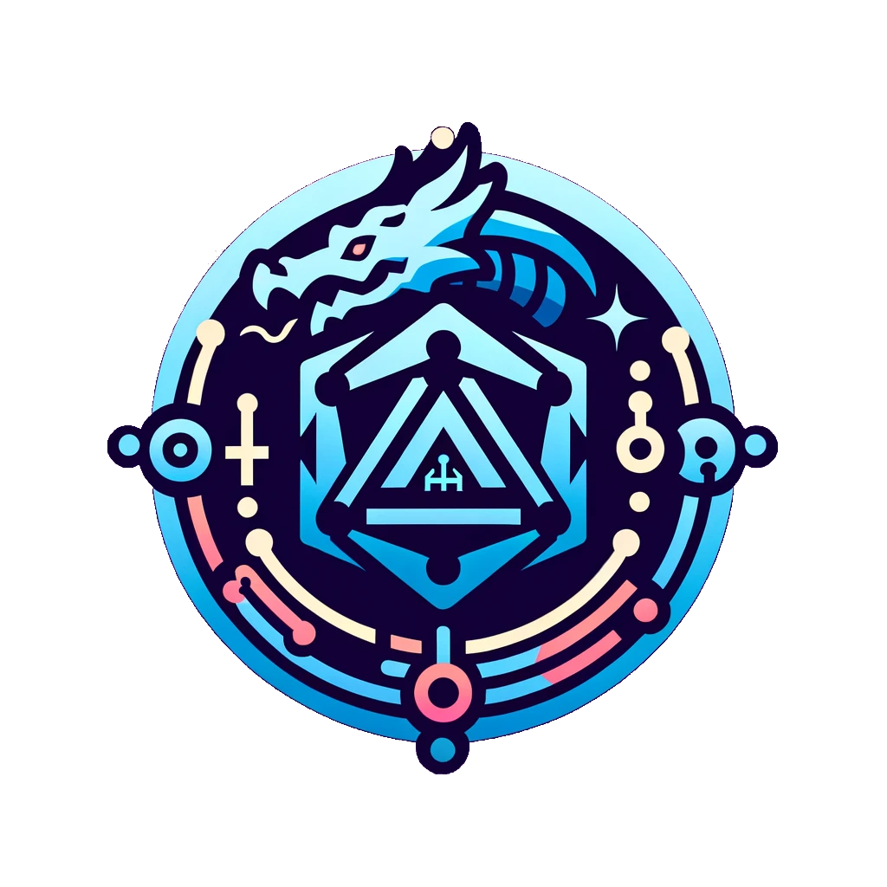

# Dungeon Delvers

![contributors-shield]

<!-- Project Logo -->
 

  
  
  <h3 align="center">Dungeon Delvers</h3>

  

    A virtual character sheet for D&D 5e!
     
    <a href="https://github.com/kishotta/dungeon-delvers"><strong>Explore the docs »</strong></a>
     
     
    <a href="https://github.com/kishotta/dungeon-delvers/issues">Report Bug</a>
    ·
    <a href="https://github.com/kishotta/dungeon-delvers/issues">Request Feature</a>
  

Dungeon Delvers is designed to be a comprehensive, user-friendly tool for Dungeons & Dragons (5th Edition) players. My goal is to create a digital solution that allows players to effortlessly manage and track all aspects of their D&D characters - from basic information like race and class to more detailed elements such as abilities, inventory, and spellcasting.

## Features

The character sheet will support a broad range of functionalities including, but not limited to:

- **Basic Character Information**: Manage characters' race, class, and level.
- **Health & Conditions**: Track hit points and current character conditions.
- **Stats & Proficiencies**: Record proficiency bonuses, movement speeds, initiative bonuses, armor class, skills, and expertise.
- **Inventory Management**: Keep an organized list of equipment and other items.
- **Spellcasting**: Manage spell slots and known spells for spellcasting characters.
- **Character Traits**: Detail racial features, class traits, and acquired feats.
- **Actions Management**: Track available actions, bonus actions, and reactions.
- **Proficiencies & Languages**: List character's proficiencies in armor, weapons, tools, and known languages.
- **Character Background & Notes**: Include background stories, characteristics, and player notes.

## Built With

- *Backend*: .NET 8
- *Frontend*: Angular (planned for future development)
- *Database*: [TBD]

## Project Status

This project is currently in the initial stages of development. We are focusing on setting up the basic framework and starting with the implementation of character basic information (Race, Class, Level).

## Contributing

We welcome contributions! If you're interested in helping out, please check our [issues](https://github.com/Kishotta/dungeon-delvers/issues) section to see what we're currently working on. Feel free to fork this repository and submit pull requests.

## License

This project is licensed under [TBD].

## Contact

For any questions or suggestions, please create an issue in this repository.

[contributors-shield]: https://img.shields.io/github/contributors/kishotta/dungeon-delvers?style=for-the-badge
